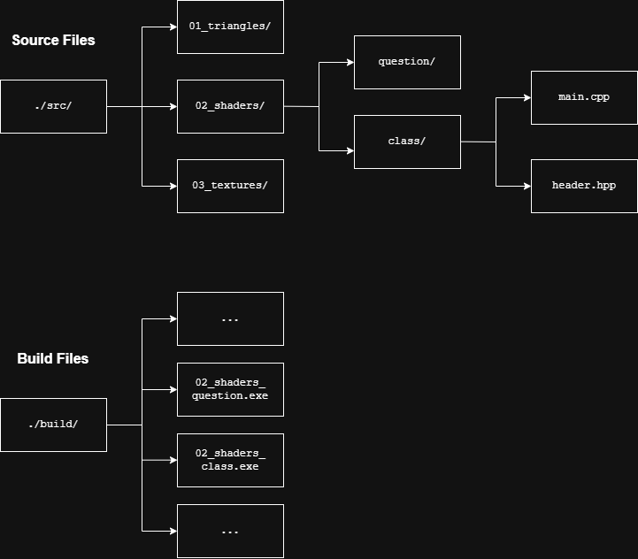

# Journal

## 1. Triangles

The first source file created was `src/triangles.cpp`. This file contains an example for one of the most simple programs possible using OpenGL. The file includes the code for opening a window, rendering two triangles, toggling between wireframe and filled polygon modes using spacebar, and closing the program using escape.

The OpenGL elements contained in this program are:
- **Vertex shader**: First shader (program which runs on the GPU) allows manipulation of vertices and allows also ensures vertices are contained within the Normalised Device Coordinates (NDC) space
- **Fragment shader**: Shader which decides the colour of recently rasterised pixels
- **Shader program**: Shader programs link compiled shaders together in an object which can be simply activated when making render calls
- **Vertex Attribute Object (VAO)**: Stores buffer and attribute configurations so that they are easier to bind later when making render calls
- **Vertex Buffer Object (VBO)**: Used to send a set of vertices to the GPU
- **Vertex attribute pointer**: Specifies how data is packed within the array sent using the VBO
- **Element Buffer Object (EBO)**: Used to send a set of indices to the GPU which describes which vertices to draw and in what order - allows for the reuse of shared vertices sent by the VBO

Ramblings:
- Whilst experimenting with the toggle for switching between line (wireframe) and fill polygon modes, I noticed there was 2 different ways of reacting to keypresses. The way described by learnopengl used polling to check each render loop which buttons, if any, had been pressed. This has the disadvantage of not debouncing the input however I assume that this also has a low overhead. For toggling my button I used keypress callback which handled the debouncing itself. I can only imagine learnopengl either wanted to get learners thinking about the render loop more or that this feature has been added to GLFW sometime in the last 10 years.
- I am currently using MinGW for this project as I don't like the idea of using a clunky IDE like Visual Studio and feel comfortable enough using cli tools. It is quite annoying however with how hard it is to debug GUI projects as stdout does not go to the terminal. To remedy this I am currently piping the executable's stdio into a text file. I have created a batch file alongside this to automate the building and running process.

## 2. Shaders

The next section is covered in the code at `src/shaders.cpp`. In this section more about vertex and fragment shaders is covered. Some of the topics covered include:

- **GLSL swizzling**: referential syntax involving combinations of `.x`, `.y`, `.z`, `.w`, e.g.: `position.xxyy`
- **GLSL in/out passthrough**: If an input/output has the same name and type then it can be passed to a shader later in the graphics pipeline
- **Uniforms**: global variables that can be defined within GLSL but modified outside of GLSL
- **Extra vertex attributes**: Extra information, for example colour, can be stored along with the vertex data
- **Fragment interpolation**: When there are many more fragments than vertices the colour of the fragment is decided by interpolating between the nearest vertices' colour

Chapters have begun using multiple files so modifications have been made to `CMakeLists.txt` to allow for projects to be made using multiple files whilst remaining modular and portable. The build files now use the following naming scheme:

